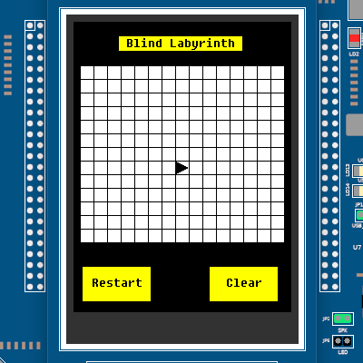
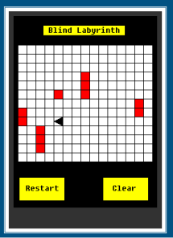
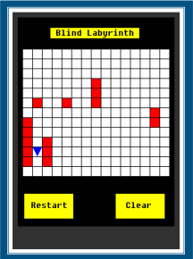
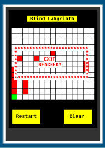

# Blind Labyrinth 

 
 

  

Project for the Computer Architectures course at Politecnico di Torino.
Implementation of the game Blind Labyrinth over the NPX LandTigerBoard.

## Brief description

The user drives a robot equipped with a proximity sensor detecting obstacles to the exit. In order to move the robot the user can use a joystick that works in two modes that can be controlled by the SELECT button:
a) EXPLORE, in which the robot cannot move, and the joystick is only used to change the robot direction. By acting on the UP/DOWN/LEFT/RIGHT directions, the robot is oriented to NORTH (N) / SOUTH (S) / WEST (W) / EAST (E), respectively. This mode is mainly intended for exploring the cells nearby the robot without any movement.
b) MOVE, in which the player can drive the robot in one of the four directions. Along with the movement, the robot is also rotated to align the proximity sensors with the movement direction. The robot advances 1 slot per second (i.e. the movement is performed after having pressed for one second the joystick in one of the four directions).
In both EXPLORE and MOVE modes, the proximity sensors are always active and can possibly detect obstacles along the direction in front of the robot. The sensors have a range of action of 5 slots. That is, they are able detect obstacles within 5 slots away from the robot. 
The player can switch between EXPLORE and MOVE by pressing the SELECT. When a new game is started, the MOVE mode is selected by default.
The touchscreen display shows the obstacles that have been detected by the robot’s proximity sensor in the current game. The robot is displayed using different color when the game is in EXPLORE mode or in MOVE mode.
The touchscreen is also used to make some actions:
- To start a new game, the user must touch the labyrinth area.
- A RESTART button can be touched to quit the current game and to show the initial screen.
- A CLEAR button can be touched to cancel all obstacles previously detected in the current game; the game continues, and the display will show new obstacles detected (including previous ones if detected again).

When the player reaches one of the exits, the game ends. To start a new game, the player must press the RESET button or touch RESTART on the screen. The joystick is disabled when the previous game ends and until the new game is started. When the game ends, an end-game message must is displayed on the touchscreen.

  

       &nbsp &nbsp
       &nbsp &nbsp
       &nbsp &nbsp
  

